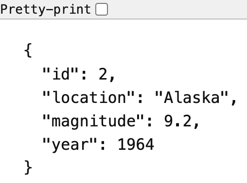
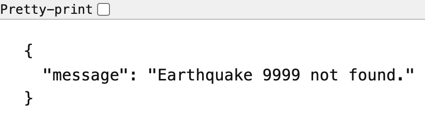
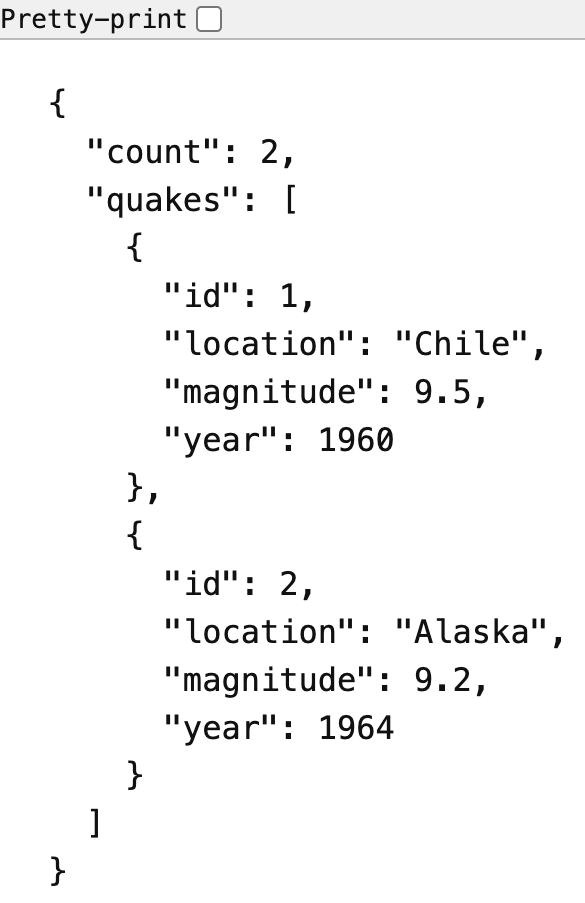

# Flask-SQLAlchemy Lab 1

JSON API for Seismic Analytics Co. It stores earthquake events in SQLite and lets clients look up a single event or list events above a magnitude threshold.

## About

Scientists previously tracked this data in spreadsheets, which produced duplicate rows and missing fields. This service keeps one `earthquakes` table and returns structured JSON for maps and charts.

Each earthquake has:

| Field | Type | Notes |
| --- | --- | --- |
| `id` | integer | Primary key |
| `magnitude` | float | Event magnitude |
| `location` | string | Where the event was recorded |
| `year` | integer | Year of the event |

## Getting started

Install dependencies and open the project virtualenv:

```console
pipenv install
pipenv shell
```

The Pipfile expects Python 3.8.13. From the `server` directory, point Flask at the app and apply the migration:

```console
cd server
export FLASK_APP=app.py
export FLASK_RUN_PORT=5555
flask db upgrade head
python seed.py
flask run
```

The app listens on [http://127.0.0.1:5555](http://127.0.0.1:5555). `python seed.py` loads five historical earthquakes and is safe to run again; it clears the table first.

## API

### `GET /`

Health check.

```json
{
  "message": "Flask SQLAlchemy Lab 1"
}
```

### `GET /earthquakes/<int:id>`

Returns the earthquake with that id.

`GET /earthquakes/2` responds with `200`:



```json
{
  "id": 2,
  "location": "Alaska",
  "magnitude": 9.2,
  "year": 1964
}
```

A missing id responds with `404`:



```json
{
  "message": "Earthquake 9999 not found."
}
```

### `GET /earthquakes/magnitude/<float:magnitude>`

Returns every earthquake whose magnitude is greater than or equal to the given value, plus a count. An empty match is still `200`.

`GET /earthquakes/magnitude/9.0` responds with `200`:



```json
{
  "count": 2,
  "quakes": [
    {
      "id": 1,
      "location": "Chile",
      "magnitude": 9.5,
      "year": 1960
    },
    {
      "id": 2,
      "location": "Alaska",
      "magnitude": 9.2,
      "year": 1964
    }
  ]
}
```

`GET /earthquakes/magnitude/10.0` responds with `200`:

```json
{
  "count": 0,
  "quakes": []
}
```

## Tests

From the `server` directory, with the database migrated and seeded:

```console
pytest
```

The suite covers the `Earthquake` model, lookup by id, and filtering by magnitude.

## Project layout

- `server/models.py` — `Earthquake` model
- `server/app.py` — Flask app and JSON routes
- `server/seed.py` — sample earthquake rows
- `server/migrations/` — Flask-Migrate revision that creates `earthquakes`
- `server/testing/` — pytest suite
